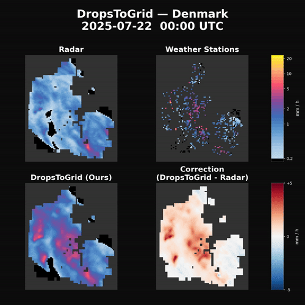

# DropsToGrid - CVPR 2026 (Findings)

Official implementation of "[From Drops to Grid: Noise-Aware Spatio-Temporal Neural Process for Rainfall Estimation](https://arxiv.org/abs/2605.05912)".

High-resolution rainfall observations are crucial for weather forecasting, water management, and hazard mitigation. Traditional operational measurements are often biased and low-resolution, limiting their ability to capture local rainfall. Accurate high-resolution rainfall maps require integrating sparse surface observations, yet existing deep learning densification methods are hindered by rainfall's skewed, localized nature, noise, and limited spatio-temporal fusion. We present DropsToGrid, a Neural Process–based method that generates dense rainfall fields by fusing temporal sequences from noisy, irregularly distributed private weather stations with spatial context from radar. Leveraging multi-scale feature extraction, temporal attention, and multi-modal fusion, the model produces stochastic, continuous rainfall estimates and explicitly quantifies uncertainty. Evaluations on real-world datasets demonstrate that DropsToGrid outperforms both operational and deep learning baselines, generating accurate high-resolution rainfall maps with well-calibrated uncertainty, even when only few stations are available and in zero-shot scenarios.

Example output of the pretrained `dtg_cvpr_dk` model on real (private) data, comparing radar, weather stations, and DropsToGrid's densified estimate:



This repository contains the minimum code needed to train and evaluate the model, scoped to the Denmark region, along with a pretrained checkpoint. The model was trained and evaluated on private data (radar, private weather stations, satellite, climate grids) that cannot be redistributed. Instead, training and evaluation run against `FakeDtGDataset`, a synthetic generator to run the full pipeline end-to-end and sanity-check the model.

## Getting started

[Install the `uv` package manager](https://docs.astral.sh/uv/), then:

```bash
uv sync
source .venv/bin/activate
```

## Pretrained checkpoint

Download the `dtg_cvpr_dk` checkpoint from Google Drive: https://drive.google.com/drive/folders/1myWuzzJMj83izt1rSJa72NOcPXwCamSP?usp=sharing.

Place it as `runs/dtg_cvpr_dk/checkpoints/`.

## Training

Start a new training run (on synthetic data, see above):
```
python main.py fit <run_name> --config configs/dtg_dk.yaml
```
This stores results in `runs/<run_name>/`.

## Evaluation

```
python main.py test --config runs/<run_name>/config.yaml <run_name> --ckpt_path runs/<run_name>/checkpoints/best.ckpt
```

## Notebook usage

To use the `dtg` package from a notebook, first install it into your environment:
```
uv pip install -e .
```
Then load a checkpoint with:
```python
model = DtGModule.load_from_checkpoint(checkpoint_path="runs/<run_name>/checkpoints/best.ckpt")
```
See `notebooks/comparison.ipynb` for a full example.

## License

This project is released under [CC BY-NC 4.0](LICENSE) (non-commercial use only, with attribution).

## Citation

If you use this code or data, please cite:

```bibtex
@InProceedings{Pablos_Sarabia_2026_DropsToGrid,
    author    = {Pablos Sarabia, Rafael and Nyborg, Joachim and Birk, Morten and Assent, Ira},
    title     = {From Drops to Grid: Noise-Aware Spatio-Temporal Neural Process for Rainfall Estimation},
    booktitle = {Proceedings of the IEEE/CVF Conference on Computer Vision and Pattern Recognition (CVPR) Findings},
    month     = {June},
    year      = {2026},
    pages     = {2606-2617}
}
```
